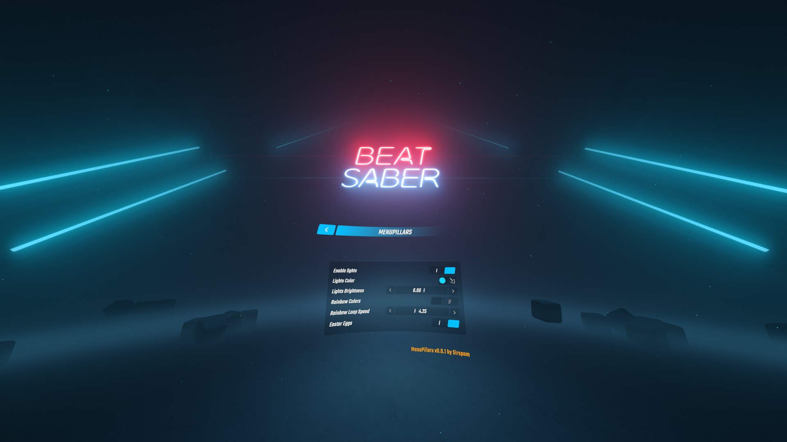

# MenuPillars
A Beat Saber mod that brings back the pillars from the 1.13.2 menu environment and adds customisable lights to them.
## Usage
MenuPillars' setting can be accessed from BSML's mods panel, to the left before selecting a game mode. These settings allow for the lights on the pillars to be customised.
## Installation
[Install](https://bsmg.wiki/pc-modding.html#install-mods) the latest version of [MenuPillars](https://github.com/Sirspam/MenuPillars/releases/latest) and the dependencies listed below.
### Dependencies
* [SiraUtil](https://github.com/Auros/SiraUtil) _- Available in ModAssistant_
* [BeatSaberMarkupLanguage](https://github.com/monkeymanboy/BeatSaberMarkupLanguage) _- Available in ModAssistant_
## Contribution
Feel free to point out any suggestions or improvements by submitting a PR or contacting me on Discord ([Sirspam#7765](https://discordapp.com/users/232574143818760192)).

